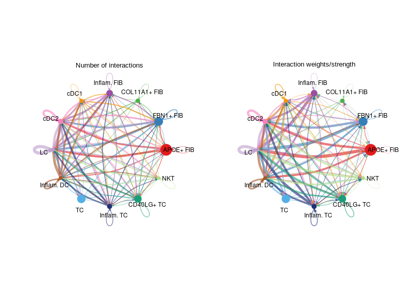
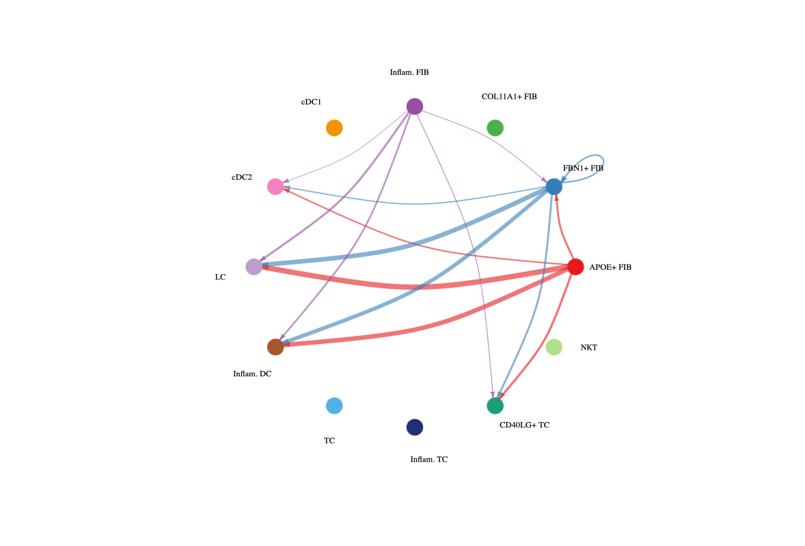
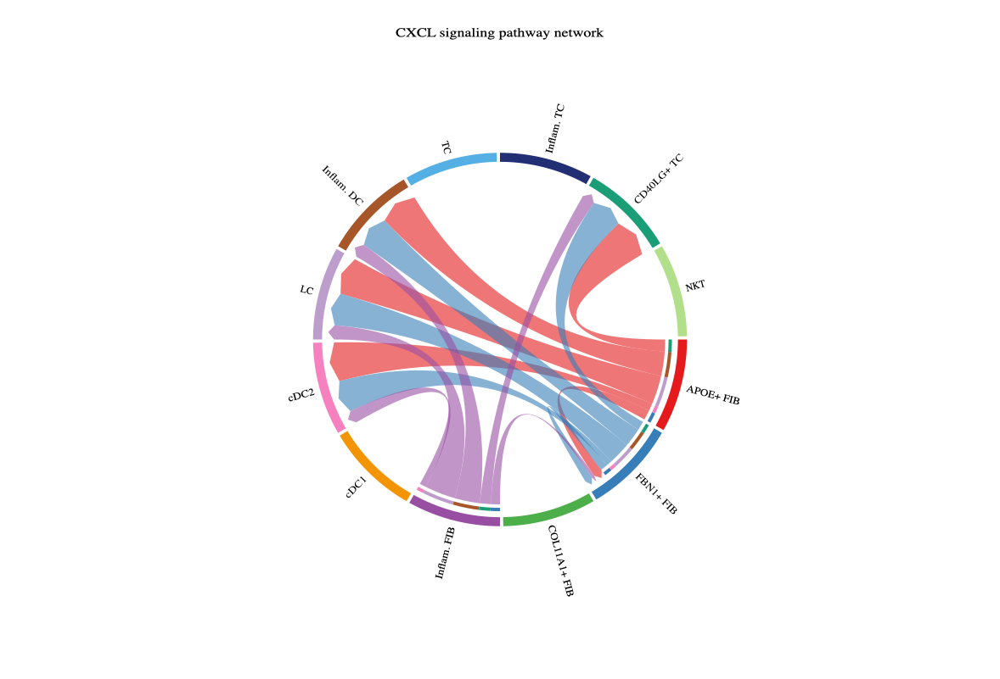
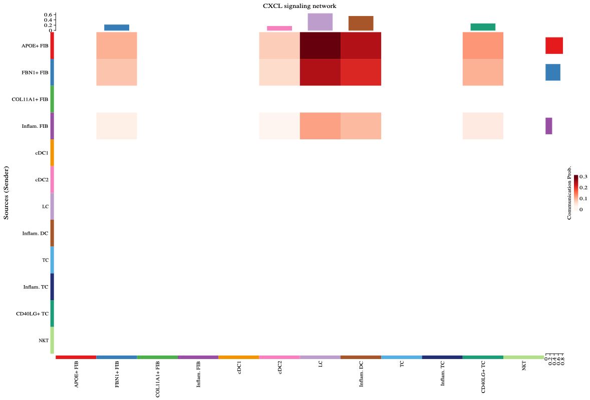
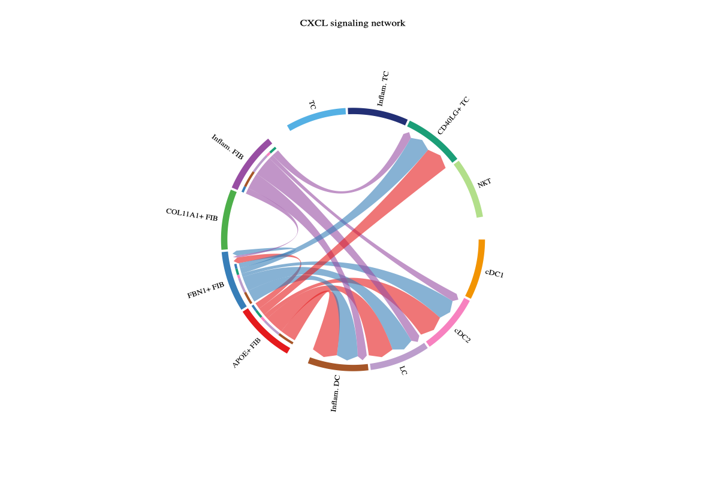
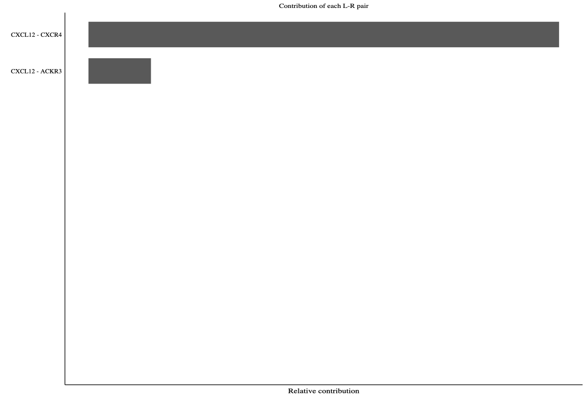
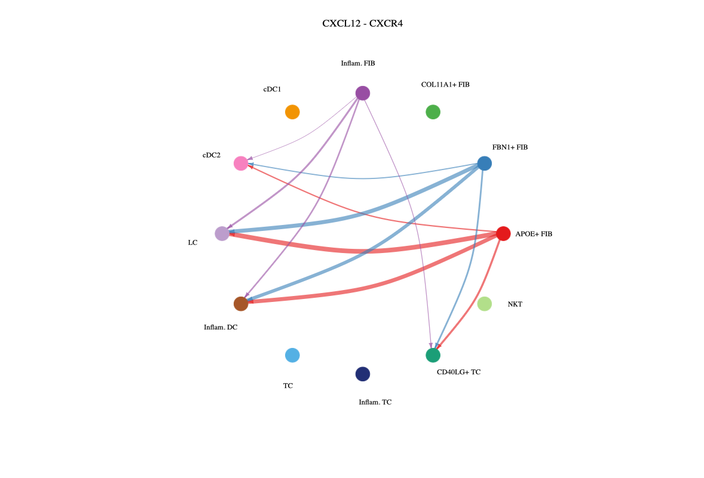
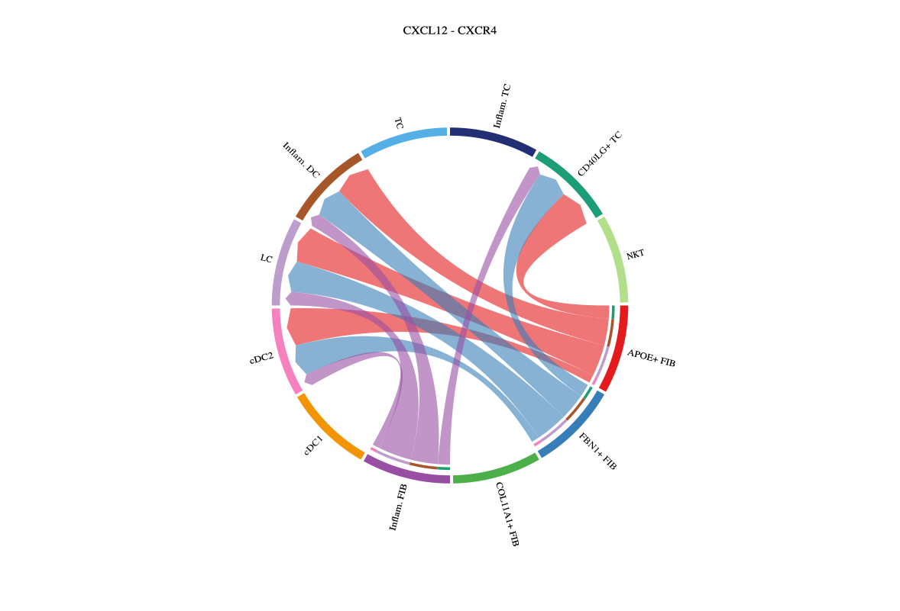
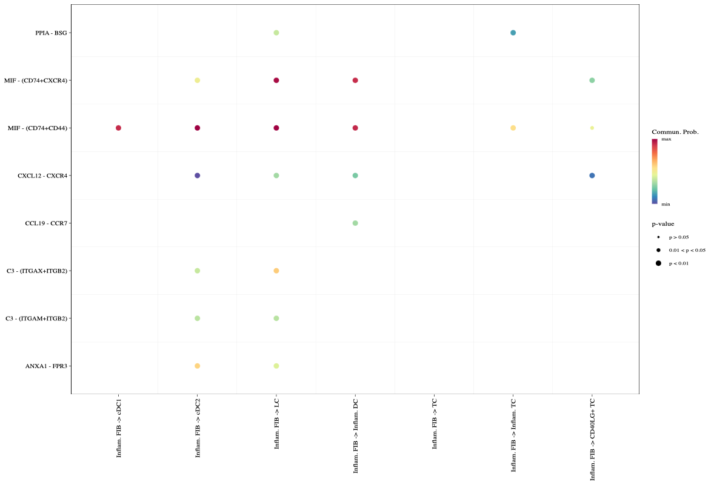

# Cell-cell communication


## CellChat
wrapper function for CellChat.(https://htmlpreview.github.io/?https://github.com/jinworks/CellChat/blob/master/tutorial/CellChat-vignette.html#c-starting-from-a-singlecellexperiment-object)
```{r}
library(sclet)

# use demo data from CellChat, hmskin_sce
# if there is no grouping variable, sclet will run clustering automatically.
cci_obj <- runCellChat(hmskin_sce, group = "labels")
```

## visulization
```{r eval = FALSE}
groupSize <- as.numeric(table(cci_obj@idents))
par(mfrow = c(1,2), xpd=TRUE)
CellChat::netVisual_circle(cci_obj@net$count, vertex.weight = groupSize, weight.scale = T, label.edge= F, title.name = "Number of interactions")
CellChat::netVisual_circle(cci_obj@net$weight, vertex.weight = groupSize, weight.scale = T, label.edge= F, title.name = "Interaction weights/strength")
```


```{r eval = FALSE}
pathways.show <- c("CXCL") 
vertex.receiver = seq(1,4) 
CellChat::netVisual_aggregate(cci_obj, signaling = pathways.show,  vertex.receiver = vertex.receiver)
par(mfrow=c(1,1))
CellChat::netVisual_aggregate(cci_obj, signaling = pathways.show, layout = "circle")
```


```{r eval = FALSE}
par(mfrow=c(1,1))
CellChat::netVisual_aggregate(cci_obj, signaling = pathways.show, layout = "chord")
```


```{r eval = FALSE}
par(mfrow=c(1,1))
CellChat::netVisual_heatmap(cci_obj, signaling = pathways.show, color.heatmap = "Reds")
```


```{r eval = FALSE}
group.cellType <- c(rep("FIB", 4), rep("DC", 4), rep("TC", 4)) # grouping cell clusters into fibroblast, DC and TC cells
names(group.cellType) <- levels(cci_obj@idents)
CellChat::netVisual_chord_cell(cci_obj, signaling = pathways.show, group = group.cellType, title.name = paste0(pathways.show, " signaling network"))
```


```{r eval = FALSE}
CellChat::netAnalysis_contribution(cci_obj, signaling = pathways.show)
```


```{r eval = FALSE}
pairLR.CXCL <- CellChat::extractEnrichedLR(cci_obj, signaling = pathways.show, geneLR.return = FALSE)
LR.show <- pairLR.CXCL[1,] 
vertex.receiver = seq(1,4)
CellChat::netVisual_individual(cci_obj, signaling = pathways.show,  pairLR.use = LR.show, vertex.receiver = vertex.receiver)
CellChat::netVisual_individual(cci_obj, signaling = pathways.show, pairLR.use = LR.show, layout = "circle")
```



```{r eval = FALSE}
CellChat::netVisual_individual(cci_obj, signaling = pathways.show, pairLR.use = LR.show, layout = "chord")
```


```{r eval = FALSE}
CellChat::netVisual_bubble(cci_obj, sources.use = 4, targets.use = c(5:11), remove.isolate = FALSE)
```
