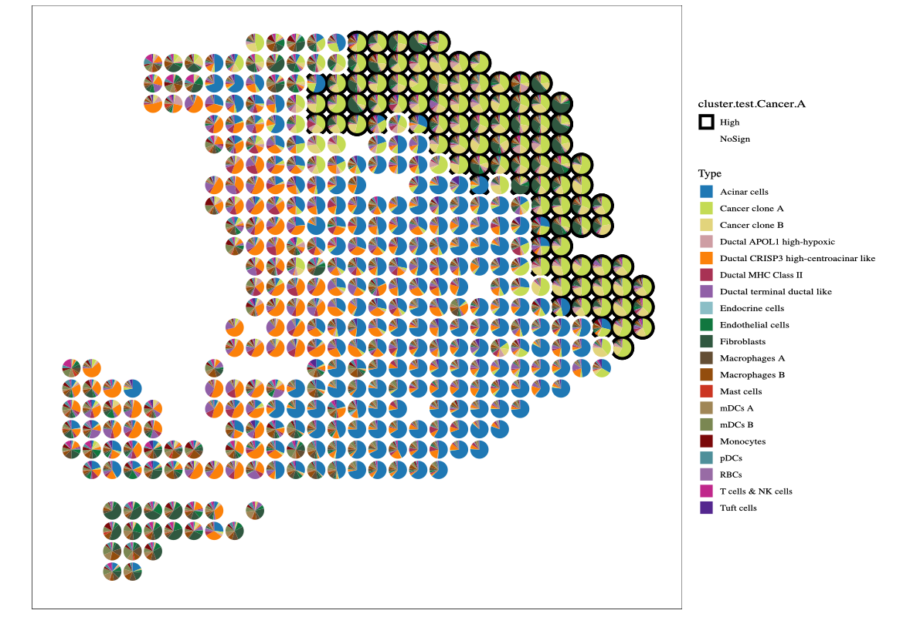
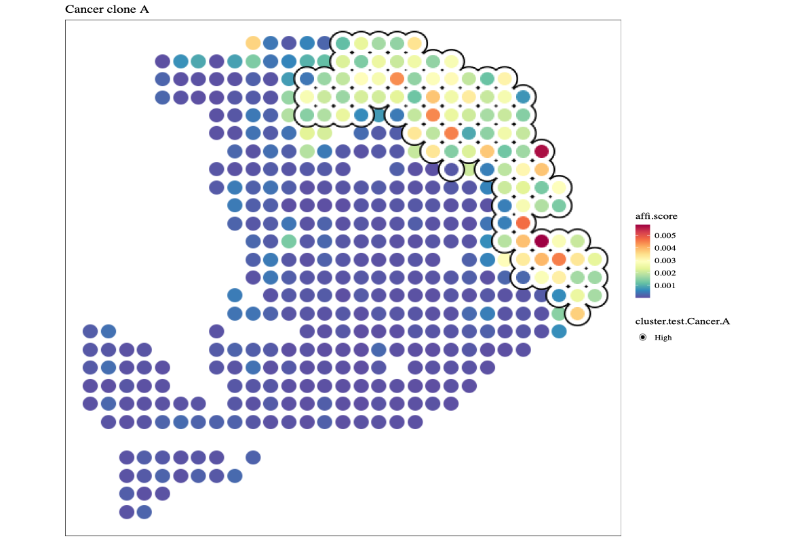
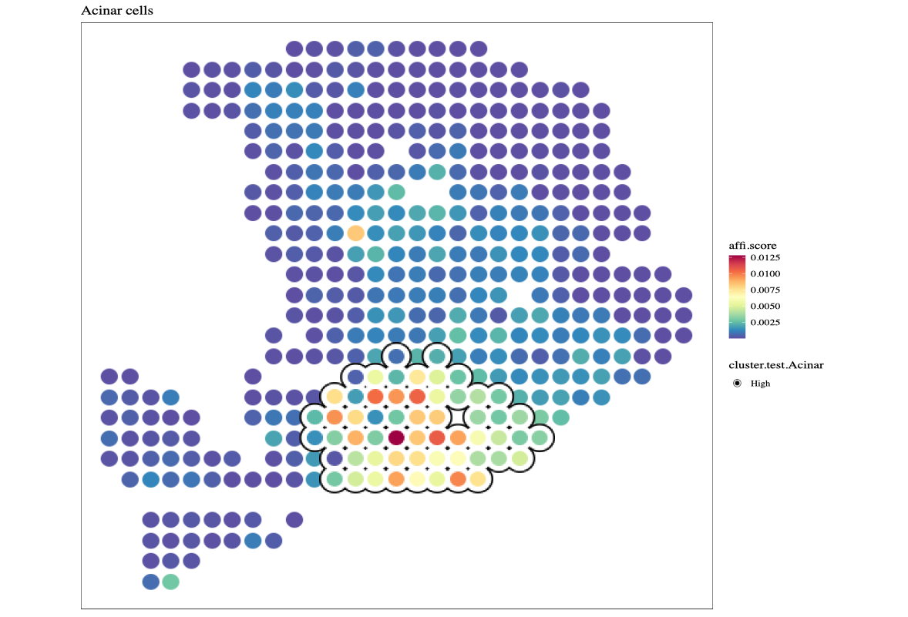
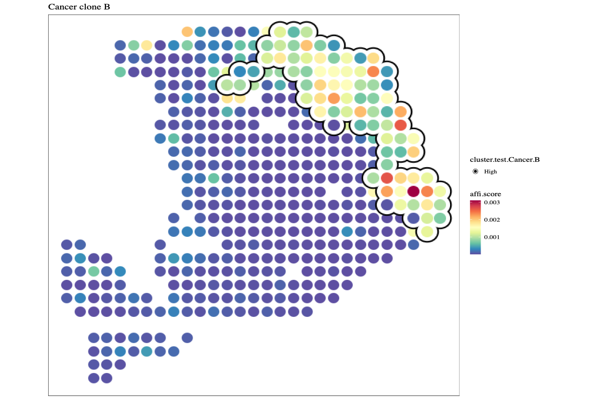

# SVP
Robust analysis of 'gene set' activity in spatial or single-cell data.

```{r eval = FALSE}
library(SpatialExperiment)
library(SVP)
data(hpda_spe_cell_dec)
```

## runLISA
Usage of local indicators of spatial association (LISA) to identify the hotspot in the spatial space
```{r eval = FALSE}
svres <- runDetectSVG(hpda_spe_cell_dec, assay.type = 'affi.score', 
                      method = 'moransi', action = 'only') 

# r$> svres |> dplyr::arrange(rank) |> head()
#                                            obs expect.moransi sd.moransi Z.moransi        pvalue          padj rank
# Cancer clone A                       0.7086916    -0.00234192 0.02803920  25.35855 3.616015e-142 7.232030e-141    1
# Acinar cells                         0.6958980    -0.00234192 0.02788076  25.04379 1.020141e-138 1.020141e-137    2
# Cancer clone B                       0.6586104    -0.00234192 0.02803039  23.57985 3.102650e-123 2.068434e-122    3
# mDCs A                               0.5824019    -0.00234192 0.02760394  21.18334 6.801396e-100  3.400698e-99    4
# Ductal CRISP3 high-centroacinar like 0.5605955    -0.00234192 0.02794187  20.14673  1.437344e-90  5.749375e-90    5
# Endothelial cells                    0.5362475    -0.00234192 0.02757573  19.53128  2.976221e-85  9.920735e-85    6
```


```{r eval = FALSE}
lisa.res12 <- hpda_spe_cell_dec |>
   runLISA(
     features = c(1, 2, 3), 
     assay.type = 'affi.score',
     weight.method = "knn",
     k = 10,
     action = 'get',
   )
lisa.res12
lisa.res12[['Acinar cells']] |> head()
lisa.res12[["Cancer clone A"]] |> head()
colData(hpda_spe_cell_dec)$`cluster.test.Cancer.A` <- lisa.res12[["Cancer clone A"]] |>
dplyr::pull(cluster.test)
colData(hpda_spe_cell_dec)$`cluster.test.Acinar` <- lisa.res12[["Acinar cells"]] |>
dplyr::pull(cluster.test)
colData(hpda_spe_cell_dec)$`cluster.test.Cancer.B` <- lisa.res12[["Cancer clone B"]] |>
dplyr::pull(cluster.test)
```

```{r eval = FALSE}
library(ggplot2)
library(ggsc)
p1 <- sc_spatial(hpda_spe_cell_dec,
            features = rownames(hpda_spe_cell_dec),
            mapping = aes(x=x, y=y, color=cluster.test.Cancer.A),
            plot.pie = T,
            pie.radius.scale = .8,
            bg_circle_radius = 1.1,
            color=NA,
            linewidth=2
) +scale_color_manual(values=c("black", "white"))
p1
```


```{r eval = FALSE}
f1 <- sc_spatial(hpda_spe_cell_dec, features="Cancer clone A",
            mapping=aes(x = x, y = y),
            pointsize=10) + 
        geom_scattermore2(mapping = aes(bg_color=cluster.test.Cancer.A, 
                          subset=cluster.test.Cancer.A=="High"),
                          bg_line_width = .16,
                          gap_line_width = .14,
                          pointsize = 7) +
        scale_bg_color_manual(values=c('black'))
f1
```


```{r eval = FALSE}

f2 <- sc_spatial(hpda_spe_cell_dec, features="Acinar cells",
            mapping=aes(x=x,y=y),
            pointsize=10) +
        geom_scattermore2(mapping = aes(bg_color=cluster.test.Acinar, subset=cluster.test.Acinar=="High"),
                          bg_line_width = .16,
                          gap_line_width = .14,
                          pointsize = 7) +
        scale_bg_color_manual(values=c('black'))
f2
```



```{r eval = FALSE}
f3 <- sc_spatial(hpda_spe_cell_dec, features="Cancer clone B",
            mapping=aes(x=x,y=y),
            pointsize=10) +
        geom_scattermore2(mapping = aes(bg_color=cluster.test.Cancer.B, subset=cluster.test.Cancer.B=="High"),
                          bg_line_width = .18,
                          gap_line_width = .14,
                          pointsize = 8) +
        scale_bg_color_manual(values=c('black'))
f3
```


## runLOCALBV
explore the local bivariate relationship in the spatial space.
```{r eval = FALSE}
res1 <- hpda_spe_cell_dec |> runLOCALBV(
          features1 = 'Cancer clone A', 
          features2 = 'Cancer clone B', 
          assay.type='affi.score'
        )
res1
res1[['Cancer clone A_VS_Cancer clone B']] |> head()


#        LocalLee           Gi       E.Gi       Var.Gi       Z.Gi Pr (z > E(Gi)) cluster.no.test cluster.test
# Spot1 0.2656572 0.0007993283 0.00234192 1.685012e-06 -1.1883644      0.8826551             Low       NoSign
# Spot2 0.1928726 0.0006520670 0.00234192 3.060135e-06 -0.9660035      0.8329788             Low       NoSign
# Spot3 0.2098906 0.0007134499 0.00234192 2.544445e-06 -1.0209003      0.8463492             Low       NoSign
# Spot4 0.2609793 0.0007131499 0.00234192 2.545557e-06 -1.0208654      0.8463409             Low       NoSign
# Spot5 0.1769749 0.0007300670 0.00234192 3.059710e-06 -0.9214789      0.8215998             Low       NoSign
# Spot6 0.1736672 0.0004656579 0.00234192 2.175086e-06 -1.2721999      0.8983489             Low       NoSign
```